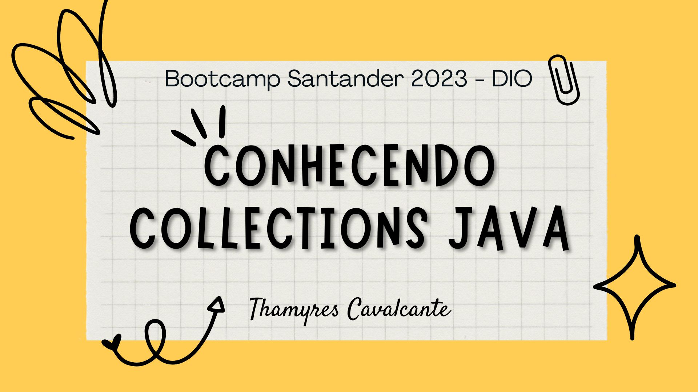

| Desafio | BOOTCAMP SANTANDER 2023 - DIO  |
| -------------  |--------------------------------|
| Nome        | **Conhecendo Collections Java**  
| Tecnologias | Java, Intellij                 
| URL         | https://github.com/Thamyresmya/Santander_Bootcamp_Back-End-Java-Collections

# Conhecendo Collections Java

 

  <a href="#-tecnologias">Tecnologias</a>&nbsp;&nbsp;&nbsp;|&nbsp;&nbsp;&nbsp;  
  <a href="#-projeto">Projeto</a>&nbsp;&nbsp;&nbsp;|&nbsp;&nbsp;&nbsp;  
  <a href="#-gif">Gif</a>&nbsp;&nbsp;&nbsp;&nbsp;&nbsp;&nbsp;

 

## 🚀 Tecnologias

Esse projeto foi desenvolvido com as seguintes tecnologias:

- Java
- Intellij
- Git e Github

## 💻 Desafio
Operações Básicas com List

1 - Lista de Tarefas 
Crie uma classe chamada "ListaTarefas" que possui uma lista de tarefas como atributo. Cada tarefa é representada por uma classe chamada "Tarefa" que possui um atributo de descrição. Implemente os seguintes métodos:

* `adicionarTarefa(String descricao)`: Adiciona uma nova tarefa à lista com a descrição fornecida.
* `removerTarefa(String descricao)`: Remove uma tarefa da lista com base em sua descrição.
* `obterNumeroTotalTarefas()`: Retorna o número total de tarefas na lista.
* `obterDescricoesTarefas()`: Retorna uma lista contendo a descrição de todas as tarefas na lista.

2 - Carrinho de Compras:  
Crie uma classe chamada "CarrinhoDeCompras" que representa um carrinho de compras online. O carrinho deve ser implementado como uma lista de itens. Cada item é representado por uma classe chamada "Item" que possui atributos como nome, preço e quantidade. Implemente os seguintes métodos:

* `adicionarItem(String nome, double preco, int quantidade)`: Adiciona um item ao carrinho com o nome, preço e quantidade especificados.
* `removerItem(String nome)`: Remove um item do carrinho com base no seu nome.
* `calcularValorTotal()`: Calcula e retorna o valor total do carrinho, levando em consideração o preço e a quantidade de cada item.
* `exibirItens()`: Exibe todos os itens presentes no carrinho, mostrando seus nomes, preços e quantidades.

## 📁 Acesso ao projeto

É possível acessar o código através do [Link](https://github.com/Thamyresmya/Santander_Bootcamp_Back-End-Java-Collections)

Neste repositório você tem acesso a todo o material desenvolvido.

## ✔️ Técnicas e tecnologias utilizadas

- `JAVA`:  A linguagem de programação Java é objetivada principalmente na orientação a objeto, independência de plataforma, recursos de rede, carga dinâmica de código e segurança, além disso, é uma linguagem copilada.

 

## 📸 Gif

Código  
</img>

Projeto funcionando 
</img>

 

Me siga nas redes sociais:
- [Linkedin](https://www.linkedin.com/in/thamyrescavalcante/)
- [Instagran](https://www.instagram.com/thamyres__cavalcante/)

 

---

Feito com 💜 by Thamyres Cavalcante.